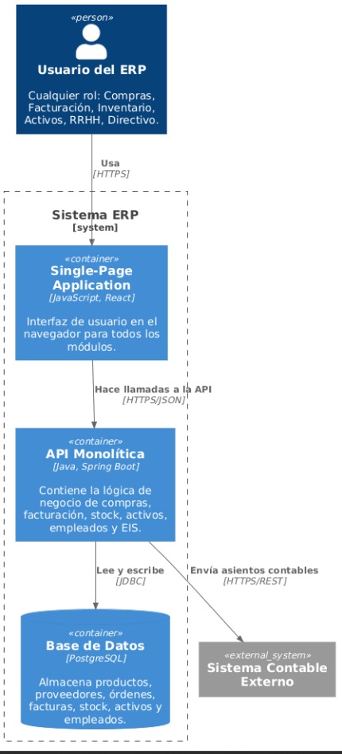
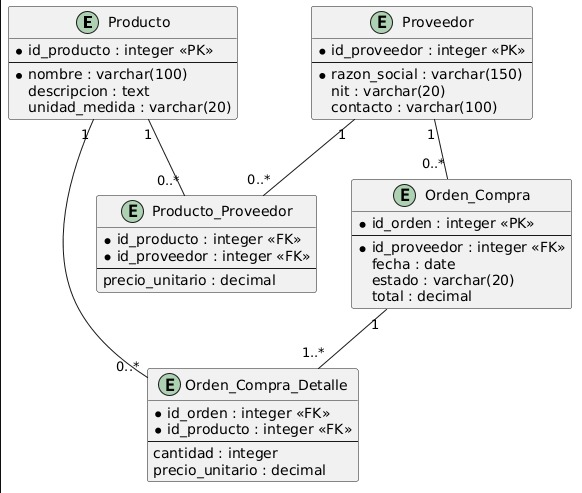

# 5. Vista de Bloques de Construcción

## 5.1 Diagrama de Contenedores (C2)

## 5.2 Responsabilidad de cada contenedor

| Contenedor | Tecnología | Responsabilidad |
|---|---|---|
| Single-Page Application | JavaScript, React | Interfaz de usuario en el navegador. Permite al Administrador de Compras registrar productos, proveedores y crear órdenes de compra. |
| API Monolítica | Java, Spring Boot | Contiene toda la lógica de negocio: validaciones, reglas del módulo de compras, orquestación de operaciones. Expone endpoints REST. |
| Base de Datos | PostgreSQL | Almacena de forma persistente productos, proveedores, órdenes de compra y su relación. |

## 5.3 Relaciones
- La SPA se comunica con la API vía HTTPS/JSON.
- La API lee y escribe en la Base de Datos vía JDBC.
## 5.4 Modelo de datos (MER)

El siguiente diagrama de Entidad-Relación detalla la estructura de datos que soporta
el Módulo de Compras, correspondiente al contenedor Base de Datos (PostgreSQL).

- **Producto**: representa un ítem que la empresa puede comprar (id, nombre, descripción, unidad de medida).
- **Proveedor**: entidad externa que suministra productos (id, razón social, NIT, contacto).
- **Producto_Proveedor**: relación N:M entre Producto y Proveedor, indicando el precio unitario que cada proveedor ofrece por producto.
- **Orden_Compra**: representa una orden generada hacia un proveedor específico, con fecha, estado y total.
- **Orden_Compra_Detalle**: relación N:M entre Orden_Compra y Producto, especificando cantidad y precio unitario por línea de la orden.
