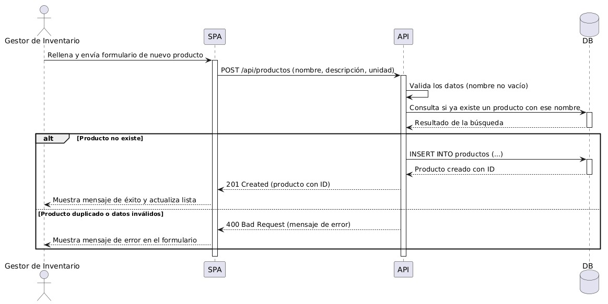

# 6. Vista de Tiempo de Ejecución

## 6.1 Escenario: Registrar un Producto

Historia de usuario relacionada: *"Como gestor de inventario, quiero registrar nuevos
productos con su información básica (nombre, descripción, unidad), para poder mantener
un catálogo actualizado para las compras."*

## 6.2 Explicación del flujo
1. El Administrador rellena el formulario de nuevo producto en la SPA y lo envía.
2. La SPA hace una petición `POST /api/productos` a la API con los datos del producto.
3. La API valida los datos recibidos (por ejemplo, que el nombre no esté vacío).
4. Si la validación es correcta, la API ejecuta un `INSERT` en la base de datos.
5. La base de datos confirma la creación y devuelve el producto con su ID generado.
6. La API responde a la SPA con un `201 Created` y los datos del producto.
7. La SPA muestra un mensaje de éxito y actualiza la lista de productos en pantalla.

Si la validación falla (ej: nombre vacío), la API responde con un error y la SPA muestra
el mensaje correspondiente sin guardar el producto.
